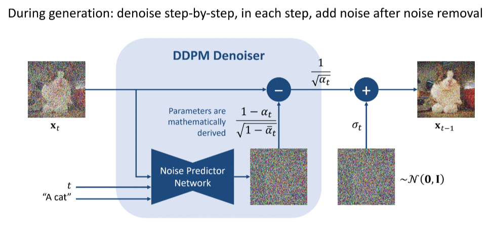

# Denoising Diffusion Probabilistic Models

## TL; DR (Summary)

 

Certainly! Here is a summary of the paper highlighting its important contributions and novelty:

**Title:** Diffusion Models and Denoising Autoencoders

**Overview:**
This paper explores the connection between diffusion models and denoising autoencoders, focusing on how these models can be used for generative tasks. Diffusion models are a type of latent variable model that involve a forward process of adding noise to data and a reverse process of denoising it. The paper introduces new insights into the training and implementation of these models, leading to improved performance and simplified objectives.

### Key Contributions

1. **Connection Between Diffusion Models and Denoising Score Matching:**
   - The paper establishes a clear link between diffusion models and denoising score matching, showing how the latter can be used to derive a simplified training objective for the former.

2. **Simplified Variational Bound Objective:**
   - By leveraging the connection to denoising score matching, the authors propose a simplified, weighted variational bound objective for training diffusion models. This new objective is easier to implement and leads to better empirical results.

3. **Two Variance Choices for Reverse Process:**
   - The paper discusses two different choices for the variance in the reverse process:
     - **First Choice:** $\sigma_t^2 = \beta_t$ which is optimal when the initial data $x_0$ is normally distributed.
     - **Second Choice:** $\sigma_t^2 = \tilde{\beta}_t = \frac{1 - \bar{\alpha}_{t-1}}{1 - \bar{\alpha}_t} \beta_t$ which is optimal when the initial data $x_0$ is deterministically set.

4. **U-Net Architecture for Noise Prediction:**
   - The authors employ a U-Net architecture for the neural network model $\epsilon_\theta$, chosen for its effectiveness in image processing tasks. The U-Net processes the noisy image $x_t$ and the time step $t$ to predict the noise $\epsilon$.

5. **Novel Training Objective:**
   - A new training objective, $L_{\text{simple}}(\theta)$, is introduced. This objective is derived from the simplified variational bound and focuses on accurately predicting the noise added during the forward process.

6. **Empirical Validation:**
   - The paper provides experimental results demonstrating the effectiveness of the proposed methods. The simplified training objective and the U-Net architecture lead to improved sample quality in generative tasks.

### Novelty:

1. **Explicit Connection to Denoising Score Matching:**
   - The novel insight of linking diffusion models with denoising score matching provides a new perspective on training these models, making the process more intuitive and grounded in existing theory.

2. **Simplified Training Objective:**
   - The introduction of the simplified variational bound objective reduces the complexity of training diffusion models, making them more accessible and easier to implement without sacrificing performance.

3. **Adaptation of U-Net Architecture:**
   - Adapting the U-Net architecture for noise prediction in diffusion models leverages its strengths in multi-scale feature extraction, which is innovative in the context of generative modeling.

4. **Comprehensive Analysis of Variance Choices:**
   - The detailed analysis and comparison of different variance settings for the reverse process provide practical insights for optimizing diffusion models under different data assumptions.

### Conclusion:
The paper makes significant contributions to the field of generative modeling by simplifying the training of diffusion models and connecting them to denoising score matching. The proposed methods enhance the practicality and performance of diffusion models, backed by solid theoretical foundations and empirical results.

---

## Introduction
 

> A diffusion probabilistic model (which we will call a “diffusion model” for brevity) is a **parameterized Markov chain** trained using **variational inference** to produce samples matching the data after finite time. Transitions of this chain are learned to reverse a diffusion process, which is a Markov chain that gradually adds noise to the data in the opposite direction of sampling until signal is destroyed. When the diffusion consists of small amounts of Gaussian noise, **it is sufficient to set the sampling chain transitions to conditional Gaussians too**, allowing for a particularly simple neural network parameterization.

### Key Terms Explained 
 

> Parameterized Markov Chain

* _ Markov Chain_: 
A Markov chain is a stochastic process that transitions from one state to another in a sequence of steps. The key property is that the probability of transitioning to the next state depends only on the current state (memoryless property).
* _Parameterized_:  
In this context, "parameterized" means that the transitions between states in the Markov chain are controlled by parameters, typically learned by a neural network. These parameters are adjusted during the training process to optimize the model's performance.
* _Application in Diffusion Model_: 
The diffusion model uses a Markov chain where each step involves adding a small amount of noise to the data. The parameters governing these steps are learned so that the model can effectively reverse the noise addition during sampling.

> Variational Inference

* _Inference_: 
In machine learning, inference refers to the process of drawing conclusions about the underlying probability distribution of the data.
* Variational Inference: 
This is a method used to approximate complex probability distributions. Instead of directly calculating the distribution, which may be computationally intractable, variational inference approximates it by optimizing a simpler distribution. This is done by minimizing the difference (measured by a divergence metric) between the true distribution and the approximating distribution.
* _Application in Diffusion Model_: 
In the diffusion model, variational inference is used to train the parameters of the Markov chain. The goal is to make the output of the model as close as possible to the true data distribution by minimizing a variational lower bound, which is a proxy for the divergence between the model distribution and the true distribution.
    
> "It is sufficient to set the sampling chain transitions to conditional Gaussians too".

* _Sampling Chain Transitions_: 
These are the steps in the Markov chain used during the sampling (or generation) process. Each step involves transitioning from one state to another, guided by the learned parameters.

* _Conditional Gaussians_: 
A Gaussian distribution is defined by its mean and variance. A conditional Gaussian means that these parameters are dependent on some other variable, typically the previous state in the Markov chain.
* _Sufficiency_: 
The statement means that for the model to work effectively, it is enough to use Gaussian distributions for these transitions. In other words, the transition from one state to the next during sampling can be modeled using Gaussian distributions whose parameters are conditioned on the previous state.
*_ Application in Diffusion Model_: 
When the noise added during the diffusion process is Gaussian, the reverse process (sampling) can also be modeled using Gaussian distributions. This makes the implementation simpler because Gaussian distributions are well-understood and easy to work with. The neural network parameterization refers to how the neural network is used to learn the parameters (mean and variance) of these conditional Gaussian distributions.

## Background Section 
 

> Diffusion models [53] are **latent variable models** of the form $p_\theta(x_0) := \int p_\theta(x_{0:T}) \, dx_{1:T}$, where $x_1, \ldots, x_T$ are latents of the same dimensionality as the data $x_0 \sim q(x_0)$. The joint distribution $p_\theta(x_{0:T})$ is called the **reverse process**, and it is defined as a Markov chain with learned Gaussian transitions starting at $p(x_T) = \mathcal{N}(x_T; 0, I)$:
> 
> $$
> p_\theta(x_{0:T}) := p(x_T) \prod_{t=1}^T p_\theta(x_{t-1} | x_t), \quad p_\theta(x_{t-1} | x_t) := \mathcal{N}(x_{t-1}; \mu_\theta(x_t, t), \Sigma_\theta(x_t, t))
> $$
> 
> What distinguishes diffusion models from other types of latent variable models is that the **approximate posterior $q(x_{1:T} | x_0)$, called the forward process** or diffusion process, is fixed to a Markov chain that gradually adds Gaussian noise to the data according to a variance schedule $\beta_1, \ldots, \beta_T$:
> 
> $$
> q(x_{1:T} | x_0) := \prod_{t=1}^T q(x_t | x_{t-1}), \quad q(x_t | x_{t-1}) := \mathcal{N}(x_t; \sqrt{1 - \beta_t} x_{t-1}, \beta_t I)
> $$
> 
> Training is performed by optimizing the **usual variational bound** on negative log likelihood:
> 
> $$
> \mathbb{E}[-\log p_\theta(x_0)] \leq \mathbb{E}_q \left[ -\log \frac{p_\theta(x_{0:T})}{q(x_{1:T} | x_0)} \right] = \mathbb{E}_q \left[ -\log p(x_T) - \sum_{t \geq 1} \log \frac{p_\theta(x_{t-1} | x_t)}{q(x_t | x_{t-1})} \right] =: L
> $$
> 
> The forward process variances $\beta_t$ can be learned by reparameterization [33] or held constant as hyperparameters, and expressiveness of the reverse process is ensured in part by the choice of Gaussian conditionals in $p_\theta(x_{t-1} | x_t)$, because both processes have the same functional form when $\beta_t$ are small [53]. **A notable property of the forward process is that it admits sampling $x_t$ at an arbitrary timestep $t$ in closed form**: using the notation $\alpha_t := 1 - \beta_t$ and $\bar{\alpha}_t := \prod_{s=1}^t \alpha_s$, we have:
> 
> $$
> q(x_t | x_0) = \mathcal{N}(x_t; \sqrt{\bar{\alpha}_t} x_0, (1 - \bar{\alpha}_t) I)
> $$
> 
> Efficient training is therefore possible by optimizing random terms of $L$ with stochastic gradient descent. Further improvements come from variance reduction by rewriting $L$ as:
> 
> $$
> \mathbb{E}_q \left[ \text{KL}(q(x_T | x_0) \parallel p(x_T)) \right] + \sum_{t > 1} \mathbb{E}_q \left[ \text{KL}(q(x_{t-1} | x_t, x_0) \parallel p_\theta(x_{t-1} | x_t)) \right] - \log p_\theta(x_0 | x_1)
> $$
> 
> (See Appendix A for details. The labels on the terms are used in Section 3.) Equation (5) **uses KL divergence to directly compare $p_\theta(x_{t-1} | x_t)$ against forward process posteriors,** which are tractable when conditioned on $x_0$:
> 
> $$
> q(x_{t-1} | x_t, x_0) = \mathcal{N}(x_{t-1}; \tilde{\mu}_t(x_t, x_0), \tilde{\beta}_t I), \quad \tilde{\mu}_t(x_t, x_0) := \frac{\sqrt{\bar{\alpha}_{t-1} \beta_t}}{1 - \bar{\alpha}_t} x_0 + \frac{\sqrt{\alpha_t (1 - \bar{\alpha}_{t-1})}}{1 - \bar{\alpha}_t} x_t, \quad \tilde{\beta}_t := \frac{1 - \bar{\alpha}_{t-1}}{1 - \bar{\alpha}_t} \beta_t
> $$
> 
> Consequently, all KL divergences in Eq. (5) are comparisons between Gaussians, so they can be calculated in a Rao-Blackwellized fashion with closed form expressions instead of high variance Monte Carlo estimates.
> 

### Key Terms Explained 
 

* > latent variable models

Models which have hidden variables, which are not observed but inferred from the observed data. Example include neural networks, where all the inner paramter weights are latent.

* > 
> $$ p_\theta(x_{0:T}) := p(x_T) \prod_{t=1}^T p_\theta(x_{t-1} | x_t), \quad p_\theta(x_{t-1} | x_t) := \mathcal{N}(x_{t-1}; \mu_\theta(x_t, t), \Sigma_\theta(x_t, t))
>  $$

  - This is the equation  of the **reverse process**. It is expressed as Markov chain. It starts from $p(x_T)$ which is the last state. Its transition is also defined as Prob of previous state given current state $p_\theta(x_{t-1} | x_t)$.

* > $$
> q(x_{1:T} | x_0) := \prod_{t=1}^T q(x_t | x_{t-1}), \quad q(x_t | x_{t-1}) := \mathcal{N}(x_t; \sqrt{1 - \beta_t} x_{t-1}, \beta_t I)
> $$

  - This is the equation of the forward process. This is also modeled as a Gaussian. 

* **In the forward process, why $q(x_{1:T} | x_0)$ called a_ approximate posterior_**?
  - Approximate Posterior

  The forward process $q(x_{1:T} | x_0)$ is referred to as an approximate posterior because:

   1. **Assumption of Gaussian Noise:**
      - **Gaussian Transitions:** The forward process assumes that the noise added at each step is Gaussian. This simplifies the model and the mathematical calculations because Gaussian distributions have desirable properties such as being fully described by their mean and variance.
      - **Complex Reality:** In reality, the true process that generates the noisy data might not strictly follow Gaussian distributions. It could involve other types of noise or complex dependencies that are not captured by simple Gaussian transitions.

  2. **Modeling Simplicity:**
      - **Tractability:** Using Gaussian noise makes the process mathematically tractable and computationally efficient. It allows for closed-form solutions and efficient optimization techniques.
      - **Simplified Assumptions:** By assuming Gaussian transitions, we simplify the forward process, making it an approximation of the true, potentially more complex, process.

  3. **Variational Inference:**
      - **Optimization Goal:** The goal in variational inference is to find a simpler, tractable distribution that approximates the true posterior. The Gaussian assumption fits this goal by providing a manageable way to simulate the noise and transitions.
      - **KL Divergence Minimization:** The training involves minimizing the KL divergence between the true posterior and the approximate posterior. The Gaussian assumption helps in making this optimization feasible.

  It is an approximate because we are using **gaussian noise** to approximate state transitions, whereas it could have been any other function which we don't know. The true distribution is something which takes from the state at $x_T$ to $x_0$ which is $p_\theta(x_{0:T})$. **We can't possibly compute it so, we use $q$ which is using a series of Gaussians to approximate it.** 

* > Training is performed by optimizing the usual variational bound on negative log likelihood  

 ** What does this mean?**

  - So, we are using $q(x_{1:T} | x_0)$ (which is joint probabilty distribution under $q$ to approximate $p_\theta(x_{0:T})$ (note that this is also joint dist). Follow this [blog: equation 2 ](https://gregorygundersen.com/blog/2021/04/16/variational-inference/) to understand how we arrived at equation 3 in the paper. Note that the equation of KL divergence for $q$ approximating $p$ (true distribution) is: 

  $$D_{KL}(q(Z) \parallel p(Z \mid X)) = \mathbb{E}_{q(Z)} \left[ \log \frac{q(Z)}{p(Z \mid X)} \right]$$ where ${E}_{q(Z)}$ is expectation under $q(z)$ which can be further expanded as: $$\left[ q(z) * \log \frac{q(Z)}{p(Z \mid X)} \right]$$

   The **ELBO** bound is a way of measuring how close is our approximation to true distribution. 

* > A notable property of the forward process is that it admits sampling $x_t$ at an arbitrary timestep $t$ in closed form using the notation $\alpha_t := 1 - \beta_t$ and $\bar{\alpha}_t := \prod_{s=1}^t \alpha_s$

  **What does this mean?**

  - This means that given the original data $x_0$, we can directly sample the noisy data $x_t$ at any arbitrary timestep $t$ without having to sequentially go through all previous steps. This direct sampling can be expressed in a closed-form solution, which is mathematically convenient and computationally efficient

* **In our sampling with Normal distribution, why is mean of the form $\sqrt{1 - \beta_t} x_{t-1}$**
  - The term $\sqrt{1 - \beta_t}$ ensures that the scaling of $x_{t-1}$ is normalized. For a sequence of $\beta_t$ values that are small, $\sqrt{1 - \beta_t}$ is close to 1, which means that  $x_{t-1}$ retains most of its scale while a small amount of noise is added. 
  - The other reason is closed form solution. We can directly go from $x_0$ to any time step $x_t$ without having to compute intermediate steps.
 
 * **Why is our forward distribution founction is the same form as reverse function?**
   - In 1949, W. Feller showed that , for a gaussian and binomial distributions, the diffusion procesess's reversal has the same functional form as forward process. 

* > $E_{q}\left[-\log p(x_{T}) - \sum_{t=1}^{T} \log \frac{q(x_{t} \mid x_{t-1})}{p_{\theta}(x_{t-1} \mid x_{t})}\right] = E_{q}\left[\text{KL}(q(x_{T} \mid x_{0}) \| p(x_{T})) + \sum_{t>1} \text{KL}(q(x_{t-1} \mid x_{t}, x_{0}) \| p_{\theta}(x_{t-1} \mid x_{t})) - \log p_{\theta}(x_{0} \mid x_{1})\right]
> $

  **What does this mean?**

  - In this equation, the authors tried to decompose the ELBO equation (eqn 5 in paper) as a series of losses at each step 

    $L_{vlb} := L_0 + L_1 + ... + L_{T-1} + L_T$  

    Looking at each term, we get:

    $L_0 := -\log p_\theta(x_0 \mid x_1)$

    $L_{t-1} := D_{KL}(q(x_{t-1} \mid x_t, x_0) \parallel p_\theta(x_{t-1} \mid x_t)$

    $L_T := D_{KL}(q(x_T \mid x_0) \parallel p(x_T))$

    Authors later tried to ignore a few loss terms: 

    - $L_0$ – The authors got better results without this
    -  $L_T$ – This is the “KL divergence” between the distribution of the final latent in the forward process and the first latent in the reverse process. However, there are no neural network parameters involved here, so we can’t do anything about it except define a good variance scheduler and use large timesteps such that they both represent an Isotropic Gaussian distribution.

    So $L_{t-1}$ is the only loss term left which is a KL divergence between the “posterior” of the forward process (conditioned on $x_t$ and the initial sample x$_0$), and the parameterized reverse diffusion process. Both terms are gaussian distributions as well.

    $L_{vlb} := L_{t-1} := D_{KL}(q(x_{t-1} \mid x_t, x_0) \parallel p_\theta(x_{t-1} \mid x_t)$

* > uses KL divergence to directly compare $p_\theta(x_{t−1}∣x_t)$ against forward process posteriors

  **Explain this**.

  - In the previous section, we explained, how the loss is just reduced to comparing the forward process posterior $q(x_{t-1} \mid x_t, x_0)$ and the reverse process $p_\theta(x_{t−1}∣x_t)$. The authors have shown that the other two terms can be ignored because they don't depend on the model parameters. 

* > $$
> q(x_{t-1} | x_t, x_0) = \mathcal{N}(x_{t-1}; \tilde{\mu}_t(x_t, x_0), \tilde{\beta}_t I), \quad \tilde{\mu}_t(x_t, x_0) := \frac{\sqrt{\bar{\alpha}_{t-1} \beta_t}}{1 - \bar{\alpha}_t} x_0 + \frac{\sqrt{\alpha_t (1 - \bar{\alpha}_{t-1})}}{1 - \bar{\alpha}_t} x_t, \quad \tilde{\beta}_t := \frac{1 - \bar{\alpha}_{t-1}}{1 - \bar{\alpha}_t} \beta_t
> $$

  **What properties of Gaussians are used to derive this?** 

  - We are given the following:

     1. The forward process transition:  
         $q(x_t \mid x_{t-1}) = N(x_t; (1 - \beta_t)x_{t-1}, \beta_t I)$

     2. The marginal distribution of $x_{t-1}$:  
         $q(x_{t-1} \mid x_0) = N(x_{t-1}; \bar{\alpha}_{t-1} x_0, (1 - \bar{\alpha}_{t-1})I)$

    We aim to find:
    $q(x_{t-1} \mid x_t, x_0)$

    We start by computing the following:

     1. _Joint Distribution_: 

      The joint distribution $q(x_t, x_{t-1} \mid x_0)$ is the product of $q(x_t \mid x_{t-1})$ and $q(x_{t-1} \mid x_0)$:

      $q(x_t, x_{t-1} \mid x_0) = q(x_t \mid x_{t-1}) q(x_{t-1} \mid x_0)$

      For this we use the following property of Gaussians:  
      **The product of two Gaussian distributions results in a distribution which is proportional to a Gaussian distribution**.

      _The mean of the product is a weighted average of the means, with weights inversely proportional to their variances and the resulting variance is the $\frac{1}{2}$ of the harmonic means of the two variances._ 

      Given:

      $p(x) \propto N_1(x; \mu_1, \Sigma_1) N_2(x; \mu_2, \Sigma_2)$

      Then the resulting distribution $p(x)$ is also Gaussian with mean $\mu$ and covariance $\Sigma$ given by:

      $\Sigma = (\Sigma_1^{-1} + \Sigma_2^{-1})^{-1}$

      $\mu = \Sigma (\Sigma_1^{-1} \mu_1 + \Sigma_2^{-1} \mu_2)$

      Using, the above property, we compute $q(x_t, x_{t-1} \mid x_0)$

    2. _Conditioning of a Gaussian_:
      
      We now use the conditioning property of Gaussians, to go from joint distribution to a conditional to find $q(x_{t-1} \mid x_t, x_0)$.

      **The conditional distribution of one normal variable given another is itself normal. The conditional mean is a linear function of the conditioned variable. The conditional variance is reduced compared to the original variance, reflecting the reduced uncertainty due to the known variable.**

      Conditional Mean: The conditional mean $\mu_{x \mid y}$ is a linear function of $y$. It adjusts the mean $\mu_x$ by an amount proportional to the difference between $y$ and its mean $\mu_y$, scaled by the correlation and the standard deviations.

      Conditional variance: It is reduced from the original $\Sigma_{xx}$ as $\Sigma_{xy} \Sigma_{yy}^{-1} \Sigma_{yx}$ is positive semi definite and hence if its $>$ 0, the conditional variance is reduced.

      For a joint Gaussian distribution of two random variables $x$ and $y$:

      $\begin{pmatrix} x \\ y \end{pmatrix} \sim N \left( \begin{pmatrix} \mu_x \\ \mu_y \end{pmatrix}, \begin{pmatrix} \Sigma_{xx} & \Sigma_{xy} \\ \Sigma_{yx} & \Sigma_{yy} \end{pmatrix} \right)$

      The conditional distribution $p(x \mid y)$ is also Gaussian, with mean $\mu_{x \mid y}$ and covariance $\Sigma_{x \mid y}$ given by:

      $\mu_{x \mid y} = \mu_x + \Sigma_{xy} \Sigma_{yy}^{-1} (y - \mu_y)$

      $\Sigma_{x \mid y} = \Sigma_{xx} - \Sigma_{xy} \Sigma_{yy}^{-1} \Sigma_{yx}$

    3. _Posterior Mean _:
    
      Thus the posterior mean $\tilde{\mu}_t(x_t, x_0)$ after simplification becomes: 

      $\tilde{\mu}_t(x_t, x_0) = \frac{\bar{\alpha}_{t-1} \beta_t}{1 - \bar{\alpha}_t} x_0 + \frac{\alpha_t (1 - \bar{\alpha}_{t-1})}{1 - \bar{\alpha}_t} x_t$

    4. _Posterior Variance_:

      The posterior variance  $\tilde{\beta}_t$ after simplification is given by:

      $\Sigma_{1 \mid 2} = (1 - \bar{\alpha}_{t-1}) I - \left( \frac{(1 - \beta_t (1 - \bar{\alpha}_{t-1}))^2}{\beta_t} \right) I$

      Simplifying:

      $\tilde{\beta}_t = \frac{1 - \bar{\alpha}_{t-1}}{1 - \bar{\alpha}_t \beta_t}$

    5. _Therefore, the posterior distribution is_:

      $q(x_{t-1} \mid x_t, x_0) = N(x_{t-1}; \tilde{\mu}_t(x_t, x_0), \tilde{\beta}_t I)$

      where:

      $\tilde{\mu}_t(x_t, x_0) = \frac{\bar{\alpha}_{t-1} \beta_t}{1 - \bar{\alpha}_t} x_0 + \frac{\alpha_t (1 - \bar{\alpha}_{t-1})}{1 - \bar{\alpha}_t} x_t$

      and

      $\tilde{\beta}_t = \frac{1 - \bar{\alpha}_{t-1}}{1 - \bar{\alpha}_t \beta_t}$

## 3 Diffusion models and denoising autoencoders
 

> **Diffusion models might appear to be a restricted class of latent variable models, but they allow a large number of degrees of freedom in implementation.** One must choose the variances $\beta_t$ of the forward process and the model architecture and Gaussian distribution parameterization of the reverse process. To guide our choices, we establish a new explicit connection between diffusion models and denoising score matching (Section 3.2) that leads to a simplified, weighted variational bound objective for diffusion models (Section 3.4). Ultimately, our model design is justified by simplicity and empirical results (Section 4). Our discussion is categorized by the terms of Eq. (5).
> 
> #### 3.1 Forward process and $L_T$
>  
> 
> We ignore the fact that the forward process variances $\beta_t$ are learnable by reparameterization and instead fix them to constants (see Section 4 for details). Thus, in our implementation, the approximate posterior $q$ has no learnable parameters, so $L_T$ is a constant during training and can be ignored.
> 
> #### 3.2 Reverse process and $L_{1:T-1}$
>  
> 
> Now we discuss our choices in $p_\theta(x_{t-1} \mid x_t) = N(x_{t-1}; \mu_\theta(x_t, t), \Sigma_\theta(x_t, t))$ for $1 < t \leq T$. First, we set $\Sigma_\theta(x_t, t) = \sigma^2_t I$ to untrained time-dependent constants. Experimentally, both $\sigma^2_t = \beta_t$ and $\sigma^2_t = \tilde{\beta}_t = \frac{1 - \bar{\alpha}_{t-1}}{1 - \bar{\alpha}_t} \beta_t$ had similar results. **The first choice is optimal for $x_0 \sim N(0, I)$, and the second is optimal for $x_0$ deterministically set to one point.** These are the two extreme choices corresponding to upper and lower bounds on reverse process entropy for data with coordinate-wise unit variance [53].
> 
> Second, to represent the mean $\mu_\theta(x_t, t)$,** we propose a specific parameterization motivated by the following analysis of $L_t$. With $p_\theta(x_{t-1} \mid x_t) = N(x_{t-1}; \mu_\theta(x_t, t), \sigma^2_t I)$, we can write:**
> 
> $$L_{t-1} = \mathbb{E}_q \left[ \frac{1}{2\sigma^2_t} \lVert \tilde{\mu}_t(x_t, x_0) - \mu_\theta(x_t, t) \rVert^2 \right] + C \quad (8)$$
> 
> where $C$ is a constant that does not depend on $\theta$. So, we see that the most straightforward parameterization of $\mu_\theta$ is a model that predicts $\tilde{\mu}_t$, the forward process posterior mean. However, **we can expand Eq. (8) further by reparameterizing Eq. (4) as $x_t(x_0, \epsilon) = \sqrt{\bar{\alpha}_t} x_0 + \sqrt{1 - \bar{\alpha}_t} \epsilon$ for $\epsilon \sim N(0, I)$** and applying the forward process posterior formula (7):
> 
> $$L_{t-1} - C = \mathbb{E}_{x_0, \epsilon} \left[ \frac{1}{2\sigma^2_t} \left\lVert \tilde{\mu}_t \left( x_t(x_0, \epsilon), \frac{1}{\sqrt{\bar{\alpha}_t}} (x_t(x_0, \epsilon) - \sqrt{1 - \bar{\alpha}_t} \epsilon) \right) - \mu_\theta \left( x_t(x_0, \epsilon), t \right) \right\lVert^2 \right] \quad (9)$$
> 
> 
> $$= \mathbb{E}_{x_0, \epsilon} \left[ \frac{1}{2\sigma^2_t} \left\lVert \frac{1}{\sqrt{\alpha_t}} \left( x_t(x_0, \epsilon) - \frac{\beta_t \sqrt{1 - \bar{\alpha}_t}}{\sigma_t} \epsilon \right) - \mu_\theta \left( x_t(x_0, \epsilon), t \right) \right\lVert^2 \right] \quad (10)
> $$
> 
> ### Algorithm 1: Training
> 1. repeat
> 2. $x_0 \sim q(x_0)$
> 3. $t \sim \text{Uniform}(\{1, \ldots, T\})$
> 4. $\epsilon \sim N(0, I)$
> 5. Take gradient descent step on
> $$
> \nabla_\theta \left\| \epsilon - \epsilon_\theta \left( \sqrt{\bar{\alpha}_t} x_0 + \sqrt{1 - \bar{\alpha}_t} \epsilon, t \right) \right\|^2
> $$
> 6. until converged
> 
> ### Algorithm 2: Sampling
> 1. $x_T \sim N(0, I)$
> 2. for $t = T, \ldots, 1$ do
> 3. $z \sim N(0, I)$ if $t > 1$, else $z = 0$
> 4. $x_{t-1} = \frac{1}{\sqrt{\alpha_t}} \left( x_t - \frac{\sqrt{1 - \alpha_t}}{\sqrt{1 - \bar{\alpha}_t}} \epsilon_\theta(x_t, t) \right) + \sigma_t z$
> 5. end for
> 6. return $x_0$
> 
> Equation (10) reveals that $\mu_\theta$ must predict $\frac{1}{\sqrt{\alpha_t}} \left( x_t - \frac{\sqrt{\beta_t}}{\sqrt{1 - \bar{\alpha}_t}} \epsilon \right)$ given $x_t$. **Since $x_t$ is available as input to the model**, we may choose the parameterization
> $$
> \mu_\theta(x_t, t) = \tilde{\mu}_t \left( x_t, \frac{1}{\sqrt{\bar{\alpha}_t}} \left( x_t - \sqrt{1 - \bar{\alpha}_t} \epsilon_\theta(x_t) \right) \right) = \frac{1}{\sqrt{\alpha_t}} \left( x_t - \frac{\beta_t \sqrt{1 - \bar{\alpha}_t}}{\sqrt{1 - \bar{\alpha}_t}} \epsilon_\theta(x_t, t) \right) \tag{11}
> $$
> where $\epsilon_\theta$ is a function approximator intended to predict $\epsilon$ from $x_t$. To sample $x_{t-1} \sim p_\theta(x_{t-1} \mid x_t)$ is to compute $x_{t-1} = \frac{1}{\sqrt{\alpha_t}} \left( x_t - \frac{\sqrt{\beta_t}}{\sqrt{1 - \bar{\alpha}_t}} \epsilon_\theta(x_t, t) \right) + \sigma_t z$, where $z \sim N(0, I)$.** The complete sampling procedure, Algorithm 2, resembles Langevin dynamics** with $\epsilon_\theta$ as a learned gradient of the data density. Furthermore, with the parameterization (11), Eq. (10) simplifies to:
> $$
> \mathbb{E}_{x_0, \epsilon} \left[ \frac{\beta_t^2}{2 \sigma_t^2 \alpha_t (1 - \bar{\alpha}_t)} \left\| \epsilon - \epsilon_\theta \left( \sqrt{\bar{\alpha}_t} x_0 + \sqrt{1 - \bar{\alpha}_t} \epsilon, t \right) \right\|^2 \right] \tag{12}
> $$
> which resembles denoising score matching over multiple noise scales indexed by $t$ [55]. As Eq. (12) is equal to (one term of) the variational bound for the Langevin-like reverse process (11), we see that optimizing an objective resembling denoising score matching is equivalent to using variational inference to fit the finite-time marginal of a sampling chain resembling Langevin dynamics.
> 
> To summarize, we can train the reverse process mean function approximator $\mu_\theta$ to predict $\tilde{\mu}_t$, or by modifying its parameterization, we can train it to predict $\epsilon$. (There is also the possibility of predicting $x_0$, but we found this to lead to worse sample quality early in our experiments.) We have shown that the $\epsilon$-prediction parameterization both resembles Langevin dynamics and simplifies the diffusion model’s variational bound to an objective that resembles denoising score matching. Nonetheless, it is just another parameterization of $p_\theta(x_{t-1} \mid x_t)$, so we verify its effectiveness in Section 4 in an ablation where we compare predicting $\epsilon$ against predicting $\tilde{\mu}_t$.
> 
> #### 3.3 Data scaling, reverse process decoder, and $L_0$
>  
> 
> We assume that image data consists of integers in $\{0, 1, \ldots, 255\}$ scaled linearly to $[-1, 1]$. **This ensures that the neural network reverse process operates on consistently scaled inputs starting from the standard normal prior** $p(x_T)$. To obtain discrete log likelihoods,** we set the last term of the reverse process to an independent discrete decoder derived from the Gaussian** $N(x_0; \mu_\theta(x_1, 1), \sigma_1^2 I)$:
> $$
> p_\theta(x_0 \mid x_1) = \prod_{i=1}^D \int_{\delta^+(x_0^i)}^{\delta^-(x_0^i)} N(x; \mu_\theta^i(x_1, 1), \sigma_1^2) \, dx
> $$
> $$
> \delta^+(x) = \begin{cases}
> \infty & \text{if } x = 1 \\
> x + \frac{1}{255} & \text{if } x < 1
> \end{cases}
> $$
> $$
> \delta^-(x) = \begin{cases}
> -\infty & \text{if } x = -1 \\
> x - \frac{1}{255} & \text{if } x > -1
> \end{cases} \tag{13}
> $$
> where $D$ is the data dimensionality and the $i$ superscript indicates extraction of one coordinate. (It would be straightforward to instead incorporate a more powerful decoder like a conditional autoregressive model, but we leave that to future work.) Similar to the discretized continuous distributions used in VAE decoders and autoregressive models [34, 52], our choice here ensures that the variational bound is a lossless codelength of discrete data, without need of adding noise to the data or incorporating the Jacobian of the scaling operation into the log likelihood. At the end of sampling, we display $\mu_\theta(x_1, 1)$ noiselessly.
> 
> ### 3.4 Simplified training objective
>  
> 
> With the reverse process and decoder defined above, the variational bound, consisting of terms derived from Eqs. (12) and (13), is clearly differentiable with respect to $\theta$ and is ready to be employed for training. However, we found it beneficial to sample quality (and simpler to implement) to train on the following variant of the variational bound:
> 
> $$
> L_{\text{simple}}(\theta) := \mathbb{E}_{t,x_0,\epsilon} \left[ \left\| \epsilon - \epsilon_\theta \left( \sqrt{\bar{\alpha}_t} x_0 + \sqrt{1 - \bar{\alpha}_t} \epsilon, t \right) \right\|^2 \right] \tag{14}
> $$
> 
> where $t$ is uniform between 1 and $T$. The $t = 1$ case corresponds to $L_0$ with the integral in the discrete decoder definition (13) approximated by the Gaussian probability density function times the bin width, ignoring $\sigma_1^2$ and edge effects. The $t > 1$ cases correspond to an unweighted version of Eq. (12), analogous to the loss weighting used by the NCSN denoising score matching model [55]. ($L_T$ does not appear because the forward process variances $\beta_t$ are fixed.) Algorithm 1 displays the complete training procedure with this simplified objective.
> 
> Since our simplified objective (14) discards the weighting in Eq. (12), it is a weighted variational bound that emphasizes different aspects of reconstruction compared to the standard variational bound [18, 22]. In particular, our diffusion process setup in Section 4 causes the simplified objective to down-weight loss terms corresponding to small $t$. These terms train the network to denoise data with very small amounts of noise, so it is beneficial to down-weight them so that the network can focus on more difficult denoising tasks at larger $t$ terms. We will see in our experiments that this reweighting leads to better sample quality.
> 

### Key Terms Explained 
 

* >Diffusion models might appear to be a restricted class of latent variable models, but they allow a large number of degrees of freedom in implementation.

  **Explain this.** 

    - The diffusion process might appear restricted becuase of a fixed forward process (fixed $\beta$s ) and our Gaussian assumption of the noise, such that other forms of complex noises can't be modeled.  

    However, authors point out that it gives various degrees of freedom:

      - CHoice of variance
      - Choice of noise scheduling
      - Choice of parametrization of mean and variance in reverse process. 
      - Authors used a form of Variational bound for loss, but it can felixible.
      - Freedom of using neural network architecture to parametrize neural nets.

* > The first choice is optimal for $x_0∼N(0,I)$), and the second is optimal for $x_0$​ deterministically set to one point.

  ** What is the rational behind the two choices of variance in the reverse process?**

    - Let's look at the two choices of variance suggested by authors:

      1. _First Choice: $\sigma_t^2 = \beta_t$_: 

        **Setting:** The variance in the reverse process is set to match the variance added in the forward process at each time step $t$:

        $$\Sigma_\theta(x_t, t) = \sigma_t^2 I \text{ with } \sigma_t^2 = \beta_t$$

        **Scenario:** This choice is optimal when the initial data $x_0$ is assumed to be normally distributed:

        $$x_0 \sim N(0, I)$$

        **Explanation:**

          - When $x_0$ is normally distributed, it means that each element of $x_0$ is a random variable drawn from a standard normal distribution with mean 0 and variance 1.
          - In this case, the noise added in the forward process and the noise removed in the reverse process have symmetrical properties. This symmetry simplifies the learning task for the model because the process of adding noise in the forward direction and removing noise in the reverse direction are well-aligned.
          - This setup leverages the statistical properties of normal distributions, making it easier for the model to learn the denoising process effectively.

      2. Second Choice: $\sigma_t^2 = \tilde{\beta}_t = \frac{1 - \bar{\alpha}_{t-1}}{1 - \bar{\alpha}_t} \beta_t$

        **Setting:** The variance in the reverse process is a modified version of the variance added in the forward process, taking into account the cumulative effect of noise over time:

        $$
        \Sigma_\theta(x_t, t) = \sigma_t^2 I \text{ with } \sigma_t^2 = \tilde{\beta}_t = \frac{1 - \bar{\alpha}_{t-1}}{1 - \bar{\alpha}_t} \beta_t
        $$

        **Scenario:** This choice is optimal when the initial data $x_0$ is deterministically set, meaning it is fixed and has no inherent randomness:

        $$
        x_0 = \text{constant value}
        $$

        **Explanation:**

          - When $x_0$ is deterministically set, it means that $x_0$ is a fixed, non-random value. For example, $x_0$ could be a specific image, a constant vector, or any predefined data point.
          - "No inherent randomness" means that there is no variation or uncertainty in $x_0$; it is always the same value whenever it is used. This contrasts with a normally distributed $x_0$, where each element is a random variable.
          - In this scenario, the modified variance $\tilde{\beta}_t$ accounts for the fact that the noise introduced in the forward process accumulates over time steps. This adjustment ensures that the reverse process properly compensates for this accumulated noise when denoising $x_t$.
          - The choice of $\tilde{\beta}_t$ helps the model handle the specific case where $x_0$ does not vary, ensuring effective denoising even when starting from a fixed point.

* > we propose a specific parameterization motivated by the following analysis of $L_t$. With $p_\theta(x_{t-1} \mid x_t) = N(x_{t-1}; \mu_\theta(x_t, t), \sigma^2_t I)$, we can write: (Equation 8)         

  **How is the Equation (8) derived?**

  TO understand how Equation 8 is derived, we need to understand the KL divergence of two gaussians. **The KL Divergence between two multivariate gaussians** $N(\mu_1, \Sigma_1)$ and $N(\mu_2, \Sigma_2)$ is defined as: 

    $$KL \left( N(\mu_1, \Sigma_1) \parallel N(\mu_2, \Sigma_2) \right) = \frac{1}{2} \left( \text{tr}(\Sigma_2^{-1} \Sigma_1) + (\mu_2 - \mu_1)^T \Sigma_2^{-1} (\mu_2 - \mu_1) - k + \log \frac{\det \Sigma_2}{\det \Sigma_1} \right)$$

  In our formulation, the variance of forward and reverse processes is fixed. So, we only need to be concerned with the terms which depend on $\mu_\theta(x_t, t)$. This term is the middle quadratic term

  $$(\mu_2 - \mu_1)^T \Sigma_2^{-1} (\mu_2 - \mu_1) = (\mu_\theta(x_t, t) - \tilde{\mu}_t(x_t, x_0))^T (\sigma_t^2 I)^{-1} (\mu_\theta(x_t, t) - \tilde{\mu}_t(x_t, x_0))$$

  Since $(\sigma_t^2 I)^{-1} = \frac{1}{\sigma_t^2} I$, it is scalar and moved out, we have $A^TA$ form which leads to $L_2$ norm:

  $$= (\mu_\theta(x_t, t) - \tilde{\mu}_t(x_t, x_0))^T \frac{1}{\sigma_t^2} I (\mu_\theta(x_t, t) - \tilde{\mu}_t(x_t, x_0)) = \frac{1}{\sigma_t^2} \| \mu_\theta(x_t, t) - \tilde{\mu}_t(x_t, x_0) \|^2
  $$

 

* > we can expand Eq. (8) further by reparameterizing Eq. (4) as $x_t(x_0, \epsilon) = \sqrt{\bar{\alpha}_t} x_0 + \sqrt{1 - \bar{\alpha}_t} \epsilon$ for $\epsilon \sim N(0, I)$

  **How can we reparametrize a gaussian like this?**

  - The key property used here is that **a Gaussian random variable can be reparameterized in terms of a deterministic transformation of another Gaussian random variable**. Specifically:

    For a Gaussian random variable $x$ with mean $\mu$ and variance $\sigma^2$, we can write:
    $$
    x = \mu + \sigma \epsilon
    $$
    where $\epsilon \sim N(0, 1)$.

    In this expression notation, $N(x_{t-1}; \mu_\theta(x_t, t), \sigma^2_t I)$, we have $x_{t-1}$ is modeled by Normal function with given mean and variance.

 

* > Since $x_t$ is available as input to the model

  **Where is this $X_t$ coming from during training and inference?**

  - $x_t$ at any step $t$ is available as input to the model during both training and inference. During training, **$x_t$ is generated from $x_0$ using the forward process**, and during inference, **$x_t$ is the intermediate latent variable obtained from the previous step in the reverse process**. This sequential availability of $x_t$ is what allows the model to denoise the data step-by-step.

 

* > $$\mu_\theta(x_t, t) = \tilde{\mu}_t \left( x_t, \frac{1}{\sqrt{\bar{\alpha}_t}} \left( x_t - \sqrt{1 - \bar{\alpha}_t} \epsilon_\theta(x_t) \right) \right) = \frac{1}{\sqrt{\alpha_t}} \left( x_t - \frac{\beta_t \sqrt{1 - \bar{\alpha}_t}}{\sqrt{\alpha_t}} \epsilon_\theta(x_t, t) \right)$$

  **The authors chose to parametrize $\mu_\theta(x_t, t)$ in the same way as $\tilde{\mu}_t(x_t, x_0)$. What was the objective and how is it mathematical feasible?**

   - The authors parametrized the true posterior mean $\tilde{\mu}_t$ in a form involving $x_t$ as :

    $$
    \tilde{\mu}_t = \frac{1}{\sqrt{\bar{\alpha}_t}} \left( x_t - \frac{\beta_t}{\sqrt{1 - \bar{\alpha}_t}} \epsilon \right)
    $$

    This shows how the true posterior mean can be expressed using the current state $x_t$ and the noise term $\epsilon$. 

    Expressing the $\mu_\theta$ in the same form as above, makes it easier to compare them and move towards simplifying the training objective. **By aligning them together, the model directly learns to predict the noise added instead.** This facilitates the model's ability to remove the appropriate amount of noise at each step, improving the denoising process.

* >  The complete sampling procedure, Algorithm 2, resembles Langevin dynamics

  **What is Langevin dynamic connection here?**

  - Langevin dynamics are used to simulate the evolution of a system of particles in a potential field, incorporating both deterministic and stochastic components. The general form of the Langevin equation is:

    $$
    dx = -\nabla U(x) \, dt + \sqrt{2\beta^{-1}} \, dW_t
    $$

    where:

    - $U(x)$ is the potential energy function.
    - $\nabla U(x)$ is the gradient of the potential energy (force).
    - $\beta$ is related to the temperature of the system.
    - $W_t$ is a Wiener process or Brownian motion term, representing stochastic noise.

    Now, you can think of $\nabla U(x)$ as the fixed term and the  $W_t$ term as the noise $\sigma^2(z)$. So, **whenever we have a system where we have fixed force like term driving a particle (an image here) from a random state to its true state and we add a noise component to make sure it doesn't stuck into local maximas, such a paradigm is called Langevin Dynamics. **

 

* > This ensures that the neural network reverse process operates on consistently scaled inputs starting from the standard normal prior

  **Explain this.**

   - Scaling the data to [−1,1] ensures that the neural network in the reverse process operates on inputs that are consistent and standardized. That's because a sample from normal distribution $N(0, 1)$ is centered around 0. Hence, the choice of scale fits the range of normal.

 

* > we set the last term of the reverse process to an independent discrete decoder derived from the Gaussian

  - While the diffusion process operates on continuous data (scaled images), the final output needs to be converted back to discrete values to match the original image format (integers in {0,1,…,255}). The final step in the reverse process involves transforming the continuous predictions back into discrete log likelihoods. This is achieved by setting the last term of the reverse process to an independent discrete decoder. 
   
  $\mu_\theta(x_1, 1)$: This is the predicted mean of the Gaussian distribution for the final denoising step, where $x_1$ is the input at the second-to-last step and 1 indicates this is the final step in the reverse process.
   
  Simply put, 
    - If $x_{0i} < -1$: The value is considered as $-1$.
    - If $x_{0i} > 1$: The value is considered as $1$.

## Practical Implementation 
 

### Model to Estimate $\theta$

 * The authors use a neural network to parameterize $\epsilon_\theta(x_t, t)$ which predicts the noise added during the forward diffusion process.
 * **Neural Network (U-Net):**
The U-Net architecture is chosen due to its success in various image processing tasks. The network takes the noisy image $x_t$ and the time step $t$ as inputs and outputs the predicted noise $\epsilon_\theta(x_t, t)$. The architecture involves downsampling the input image to capture context and then upsampling to restore the original resolution, allowing the network to use features at multiple scales effectively.

* **Training Objective**:

  The training objective is the simplified loss function $L_{\text{simple}}(\theta)$:
  $$
  L_{\text{simple}}(\theta) := \mathbb{E}_{t, x_0, \epsilon} \left[ \left\| \epsilon - \epsilon_\theta \left( \sqrt{\bar{\alpha}_t} x_0 + \sqrt{1 - \bar{\alpha}_t} \epsilon, t \right) \right\|^2 \right]
  $$

  This loss function is minimized during training to make the neural network accurately predict the noise $\epsilon$.

